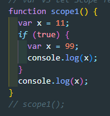

# var vs let vs const

- var : 재선언 가능 / 함수 레벨
- let : 재선언 불가능 / 블록 레벨
- const : 재선언 불가능 / 블록 레벨

### var vs let

99 99

var는 함수레벨,재선언 가능하므로 x = 99가 된다.

99 11

let x = 11의 범위는 scope2(){ } 블록

let x = 99의 범위는 if문 블록

99 99

var는 함수레벨

99 99

let은 블록 레벨

if문의 상위 블록에 선언되었으므로 모두 99

ReferenceError: x is not defined

let은 블록 레벨

if 문의 블록에 선언되었으므로 상위 블록인 scope5()에서 불가능

### const

- Object, 배열을 const로 만든다고 해도 값을 바꿀 수 있음
